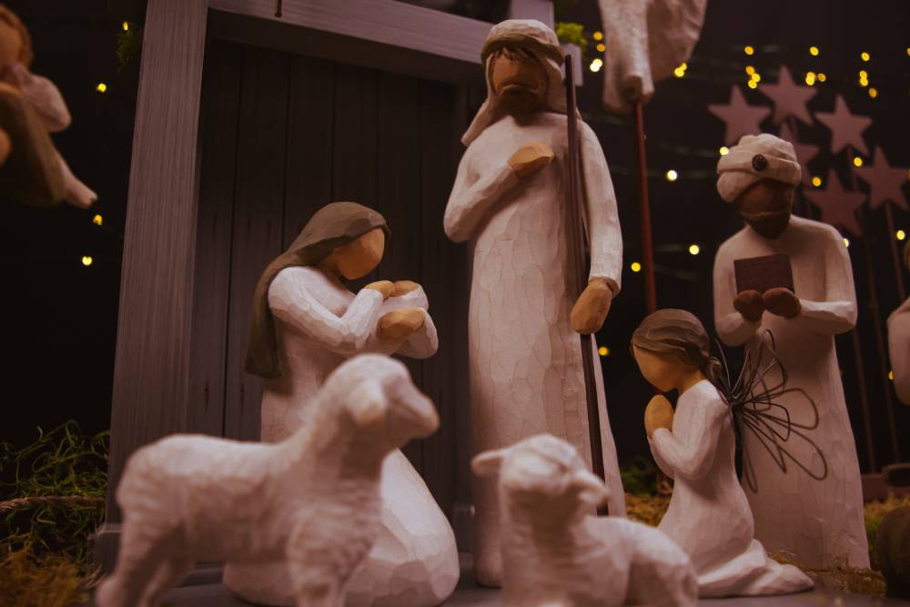

import { Author } from "../../../src/components/author.jsx";

La semana pasada compartí algunos [consejos prácticos](/haz-que-este-diciembre-sea-diferente) para ayudarte a ti y a tu familia a centrar su atención en el Adviento este diciembre. Uno de ellos era leer las Escrituras relacionadas con la Navidad durante todo el mes, y una tradición de Tripp era memorizar y recitar [Lucas 2:1-20](https://www.biblegateway.com/passage/?search=Lucas+2%3A1-20&version=NBLA).

Es un pasaje bastante largo de recordar, sobre todo para los niños más pequeños, así que aquí tenemos otra opción más corta. Quizá sea mi versículo navideño favorito: Isaías 9:6.

> Porque un Niño nos ha nacido, un Hijo nos ha sido dado, 
> Y la soberanía reposará sobre Sus hombros. 
> Y se llamará Su nombre Admirable Consejero, Dios Poderoso, 
> Padre Eterno, Príncipe de Paz.

¿Por qué me gusta tanto este pasaje? Porque en estos cuatro nombres de Jesús se encuentra el contenido completo de la historia de la Navidad.

## 1. Admirable Consejero

Es una de las contradicciones funcionales del pecado. El pecado nos reduce a tontos, pero al mismo tiempo nos convence de que somos más inteligentes que Dios. Como resultado, minimizamos el peligro de lo que Dios llama peligroso, cuestionamos la necesidad de los límites que Dios ha establecido para nosotros y, ante nuestro propio pecado, argumentamos que no es tan malo después de todo. Cada día, en alguna situación o relación, estamos tentados a pensar que somos más sabios que Dios. Sin el rescate del admirable consejo y la sabiduría de
Cristo, todos somos tontos dirigiéndonos hacia un peligro que simplemente no vemos.

## 2. Dios poderoso

El pecado no sólo nos reduce a tontos; también nos incapacita. Por eso, Jesús vino a hacer con el poder divino lo que no podíamos hacer por nosotros mismos. El pecado hace que todos seamos incapaces de ser lo que Dios diseñó que fuéramos y de hacer lo que Dios creó que hiciéramos. Así que Jesús desató su poder para derrotar al pecado y a la muerte, y luego nos capacitó para desear y hacer lo que no seríamos capaces de hacer sin su poder trabajando en y a través de nosotros.

## 3. Padre eterno

Jesús, con su vida, muerte y resurrección, nos acoge de nuevo en su familia. Él es la puerta por la que tenemos acceso a Dios. Nos prodiga su amor paternal, y somos bendecidos con todos los derechos y privilegios de ser sus hijos. Ya no estamos separados, perdidos, ajenos y solos, sino que vivimos para siempre como hijos e hijas del Rey de reyes y del Señor de señores.

## 4. Príncipe de Paz

Cristo produjo lo que tú y yo necesitamos desesperadamente, pero no tenemos poder para conseguirlo: la paz vertical y horizontal. El pecado nos aleja de Dios y de los demás, haciéndonos enemigos de Dios y poniéndonos en constante conflicto con otras personas. Por naturaleza, somos más luchadores que amantes. Pero Dios tenía una solución, un regalo que nunca podríamos conseguir, ganar o merecer. A través de la obra del Príncipe de Paz, se nos invita a vivir en una comunidad de adoración con Dios y de amor con los demás.

Así que te animo a que memorices y recites Isaías 9:6 este diciembre, quizás más que cualquier otro pasaje. No hay una profecía más conmovedora y alentadora sobre el nacimiento de Jesús que ésta.

Bajo la cuidadosa dirección del Espíritu Santo, Isaías eligió a propósito estos cuatro nombres para comunicar cómo, específicamente, el Hijo del Mesías es lo que tú y yo necesitamos desesperadamente.

Que Dios nos bendiga,

Paul David Tripp

---

_Traducción de [Memorize This Christmas Passage](https://www.paultripp.com/wednesdays-word/posts/memorize-this-christmas-passage)_

<Author authorKey="paul-tripp" />
